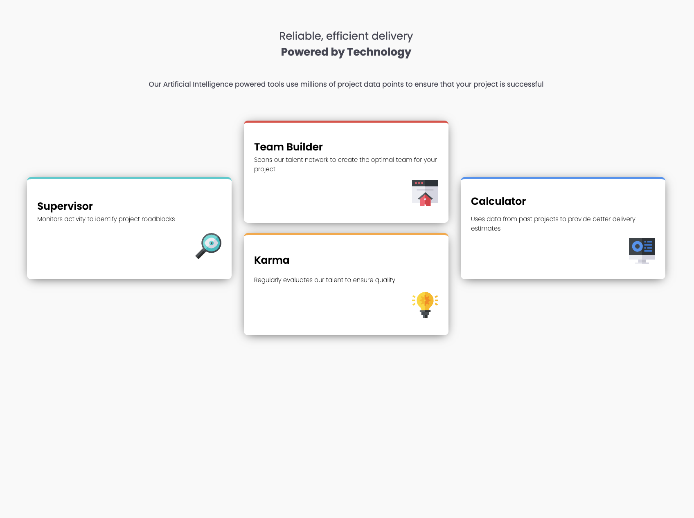

# Frontend Mentor - Four card feature section solution

This is a solution to the [Four card feature section challenge on Frontend Mentor](https://www.frontendmentor.io/challenges/four-card-feature-section-weK1eFYK). Frontend Mentor challenges help you improve your coding skills by building realistic projects.

## Overview

### The challenge

Users should be able to:

- View the optimal layout for the site depending on their device's screen size

### Screenshot

### Links

- Solution URL: [Add solution URL here](https://www.frontendmentor.io/solutions)
- Live Site URL: [Add live site URL here](https://your-live-site-url.com)

## My process

### Built with

- Semantic HTML5 markup
- CSS Grid (for the desktop card layout)
- Flexbox (for card content and body/header layout)
- Mobile-first workflow
- CSS custom properties (via the style guide colors)

### What I learned

- **CSS Grid for the “cross” layout:** The desktop layout is a 3-column, 2-row grid. The left and right cards (Supervisor, Calculator) span both rows with `grid-row: span 2` and are vertically centered with `align-self: center`. The middle column has two cards (Team Builder, Karma) in row 1 and row 2. Giving each card explicit `grid-column` and `grid-row` (and `grid-row: 1` / `grid-row: 2` for the middle two) made the layout reliable.

- **Grid placement syntax:** `grid-row: span 2` is valid (span two rows); something like `grid-row: span 1 / -1` is invalid—you use either `span` plus a number or a start/end line like `1 / -1`, not both.

- **Controlling column spacing:** `column-gap` on the grid container controls the horizontal space between the three columns; `gap` (or `row-gap`) controls the vertical space between the two middle cards.

- **Consistent card width on mobile:** Cards had `max-width: 500px` but no `width`, so they sized to content and looked different. Adding `width: 100%` made each card fill its grid cell so they’re all the same width, still limited by `max-width` on wider viewports.

- **Breakpoints:** The style guide lists mobile (375px) and desktop (1440px) design widths. Using a breakpoint like 1024px for the 3-column layout makes it appear at a comfortable “desktop” width while keeping mobile layout on smaller screens.

### Continued development

- Refining responsive breakpoints and spacing for very wide screens.
- Improving accessibility (e.g. focus states, contrast) and semantic structure where needed.

### Useful resources

- [MDN CSS Grid Layout](https://developer.mozilla.org/en-US/docs/Web/CSS/CSS_Grid_Layout) – Grid concepts and `grid-column` / `grid-row` placement.
- [CSS-Tricks Guide to Flexbox](https://css-tricks.com/snippets/css/a-guide-to-flexbox/) – Flexbox for card content and page layout.
- Project `style-guide.md` – Colors, typography, and layout widths.

### AI Collaboration

AI was used as a learning partner during this project:

- **Layout:** Got guidance on thinking in three columns and placing cards with Grid (wrapper, 3 columns, 2 rows, explicit placement and `align-self` for the side cards) instead of receiving full code.
- **Debugging:** Fixed invalid `grid-row` values (e.g. `span` without a number, or `span 1 / -1`) and added explicit placement for the middle column so all four cards had clear positions.
- **Sizing and breakpoints:** Understood why mobile cards varied in width (missing `width: 100%`) and adjusted the media query breakpoint and removed debug styles.

The approach was hint-based and step-by-step, which helped reinforce Grid and responsive concepts.

## Author

- Frontend Mentor - [@yourusername](https://www.frontendmentor.io/profile/yourusername)
